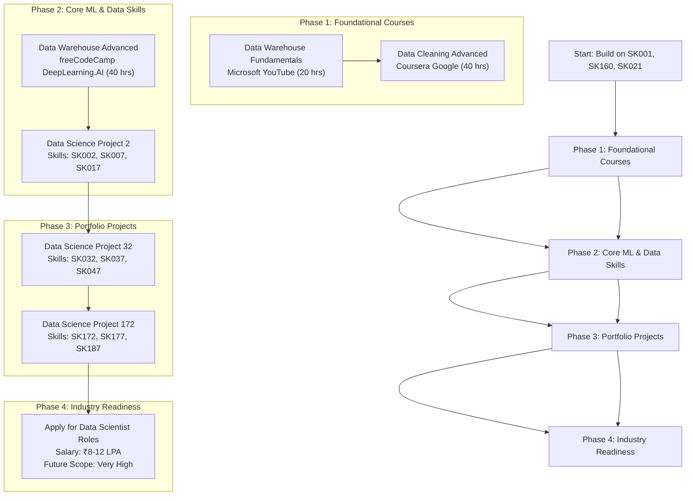

### 🎯 Your Personalized Learning Roadmap to Data Scientist (ROLE001)

Based on your profile (CS Year 3, Data Science interest, ROLE001 goal), here's your strategic roadmap to become a Data Scientist:

  <strong>Your Personalized Learning Roadmap to Data Scientist (ROLE001)</strong>
  

    
This roadmap is meticulously designed for a 3rd-year Computer Science student (Test User) with foundational skills (SK001, SK160, SK021) and an interest in Data Science, aiming for a Data Scientist role (ROLE001). It is structured to build upon your existing skills and progressively develop the expertise required for this career path, as inferred from the provided context. The journey is divided into four core phases, aligning with the practical projects and role descriptions available.

  

### 🗺️ Roadmap Flowchart

### 📊 Progress Tracking

  <strong>Current Progress Status</strong>
  

    
<strong>Phase 1:</strong> 0% (Ready to start) 
    <strong>Phase 2:</strong> 0% (Prerequisites: Phase 1) 
    <strong>Phase 3:</strong> 0% (Prerequisites: Phase 2) 
    <strong>Phase 4:</strong> 0% (Prerequisites: Phase 3)

  

### 🎯 Key Milestones

  

    <strong>🏆 Phase 1 Complete</strong> 
    Foundation courses completed
  

  

    <strong>🏆 Phase 2 Complete</strong> 
    Core ML skills + Data Warehouse expertise
  

  

    <strong>🏆 Phase 3 Complete</strong> 
    Portfolio of 2 industry projects
  

  

    <strong>🏆 Final Goal: Data Scientist</strong> 
    Target salary ₹8-12 LPA 
    Very High future scope
  

### 💡 Strategic Recommendations

  

    <strong>⚡ Quick Wins (0-4 weeks)</strong> 
    • Start Data Warehouse Fundamentals course 
    • Begin Data Cleaning Advanced course 
    • Strengthen Python & Math fundamentals
  

  

    <strong>🚀 Acceleration Path</strong> 
    • Complete Data Science Project 2 quickly 
    • Parallel project work while studying 
    • Build end-to-end data pipelines
  

*Disclaimer: This roadmap is tailored based on your profile and available learning resources. The Data Scientist role serves as your target career goal with very high future scope and competitive salary.*

*Disclaimer: Guidance is based on historical database placements.*

*Disclaimer: Guidance is based on historical database placements.*

*Disclaimer: Guidance is based on historical database placements.*

*Disclaimer: Guidance is based on historical database placements.*